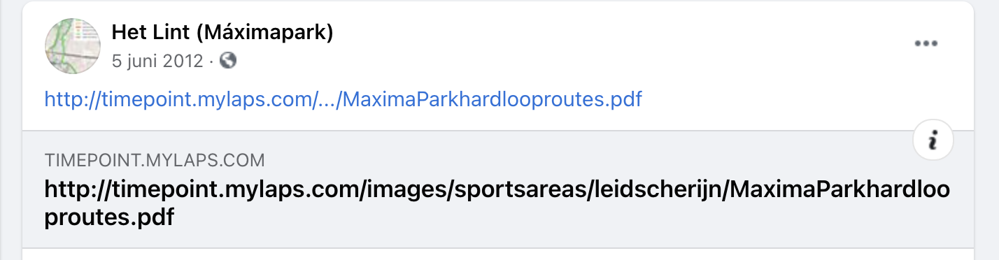

# Timepoints in het Maximapark

## Wat is een TimePoint?

Op het lint, een 8 kilometer lange ring rondom het [Maximapark](https://maximapark.nl/) in Utrecht voor fietsers en (hard)lopers, kan je om de paar kilometer zogenaamde *TimePoints* vinden.

Zo'n TimePoint is een gemarkeerde baan op het asfalt. In deze baan is apparatuur aangebracht voor tijdregistratie voor hardlopers. Deze apparatuur kan bij passage een chip lezen die bevestigd is aan bijvoorbeeld je hardloopschoen. Hiermee kunnen automatisch doorkomsttijden geregistreerd worden. 

De uitleesapparatuur en bijbehorende chips zijn ontwikkeld door [MYLAPS](https://www.mylaps.com/nl/). Deze fabrikant is o.a. bekend van tijdregistratie bij hardloopevents. De meeste hardlopers zullen die ooit aan een evenement hebben meegedaan zullen dan ook bekend zijn met de chips van MYLAPS.

Dankzij de TimePoints zou het dus mogelijk zijn om je doorkomsttijden op het Lint te laten registreren. Althans, dat is zoals het ooit is opgezet, vanaf 2011 ongeveer:

"](img/fb_screenshot.png)

*Boven: Screenshot Facebook bericht van account "[Het Lint](https://www.facebook.com/Het-Lint-M%C3%A1ximapark-330874426926136/)"*

## De huidige situatie

Wat moet je eigenlijk dan doen om gebruik te kunnen maken van deze TimePoints, en werken ze nog wel? Dat is een vraag die ik al jaren heb en waar ik af en toe aan denk als ik weer eens zo'n TimePoint passeer als ik hardloop op het lint.

Een korte zoektocht op Google naar een antwoord levert bijna niks op. Eén van weinige dingen die wel bovenkomt is bovenstaand Facebook bericht uit 2011. Ook op de website van MYLAPS is verder geen (actuele) informatie te vinden. Wat is dan de huidige status van deze meetpunten? 

Eigenlijk geeft een link uit een andere Facebook bericht van Het Lint - uit 2012 - de enige duidelijke hint:

De link naar bovenstaande PDF, verwijst inmiddels niet maar naar een PDF, maar wordt doorverwezen naar: [https://www.mylaps.com/timepoint-service-offline/](https://www.mylaps.com/timepoint-service-offline/).

Kortom, blijkbaar waren de TimingPoints ooit onderdeel van een product dat MYLAPS aanbood, maar is dit product inmiddels niet meer in de markt.

Het lijkt er dus sterk op dat de TimePoints niet meer gebruikt kunnen worden.

Maar betekent het dan dat de meetpunten en markeringen op het asfalt volkomen nutteloos zijn geworden?

Waarschijnlijk dus, maar ik zou het niet met zekerheid kunnen zeggen. Fascinerend is het wel, deze infrastructuur voor hardlopers in het grooste park van Utrecht, ooit enthousiast aangelegd en aangekondigd, om daarna langzaam in vergetelheid te verdwijnen.

!!! note "Meer informatie gevraagd"

    Omdat ik zelf bijna geen informatie kon vinden, maar anderen misschien met dezelfde vraag zitten, heb deze naslag gepubliceerd.

    Als je meer informatie hebt over het oorspronkelijke plan, de huidige staat, of toekomst van deze TimingPoints, laat het gerust weten:

    [Start onderwerp in Github Discussions](https://github.com/onderweg/timepoint-docs/discussions)